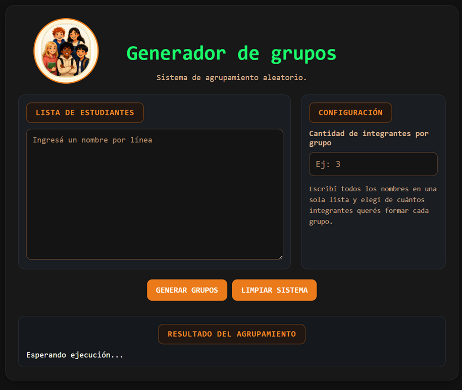
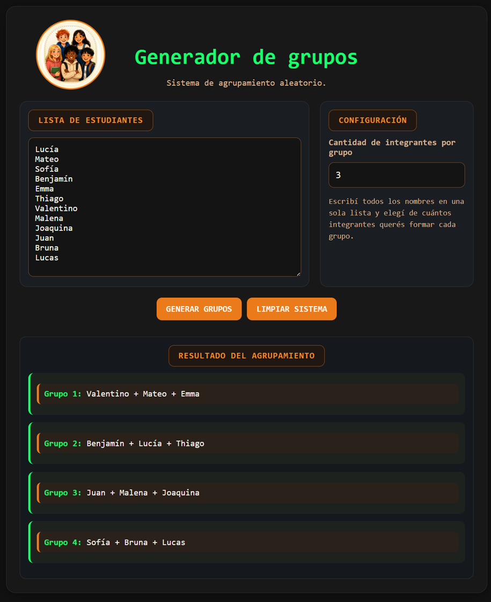

# Generador de grupos

Aplicación web simple para formar grupos aleatorios de estudiantes a partir de una lista de nombres y una cantidad de integrantes indicada por el usuario.

## Descripción

Este proyecto fue pensado como una herramienta de apoyo para la organización del aula. Permite ingresar un listado completo de estudiantes, seleccionar cuántos integrantes debe tener cada grupo y generar agrupamientos de manera aleatoria.

La propuesta surgió como una continuación de la aplicación **Compañeros de computadora**, que generaba parejas. En este caso, la herramienta amplía la funcionalidad para permitir grupos de 2, 3, 4, 5, 6 o más integrantes.

## Funcionalidades

* Ingreso de una lista de estudiantes.
* Selección de cantidad de integrantes por grupo.
* Generación aleatoria de grupos.
* Visualización clara de los resultados.
* Avisos cuando faltan datos o la configuración no es válida.
* Botón para limpiar el sistema y comenzar nuevamente.
* Diseño responsive para adaptarse a distintas pantallas.

## Tecnologías utilizadas

* HTML
* CSS
* JavaScript

## Estructura del proyecto

```text
generador-grupos
│
├── index.html
├── style.css
├── script.js
│
└── imagenes
    └── logo-grupos.png
```

## Cómo funciona

1. El usuario escribe los nombres de los estudiantes, uno debajo del otro.
2. Indica la cantidad de integrantes que desea por grupo.
3. Presiona el botón **Generar grupos**.
4. El sistema mezcla la lista de manera aleatoria.
5. Se muestran los grupos generados.
6. Si sobran estudiantes, se forma un último grupo con menos integrantes.

## Objetivo del proyecto

El objetivo principal es crear una herramienta sencilla, práctica y útil para docentes o coordinadores que necesitan organizar grupos de trabajo de forma rápida y justa.

Además, el proyecto permite practicar conceptos fundamentales de desarrollo web:

* estructura HTML;
* estilos con CSS;
* manipulación del DOM;
* funciones en JavaScript;
* validaciones simples;
* generación aleatoria de datos;
* diseño responsive.

## Estado del proyecto

Proyecto funcional en etapa inicial.
Puede seguir ampliándose con nuevas funcionalidades.

## Posibles mejoras futuras

* Permitir copiar los grupos generados.
* Agregar opción para descargar los resultados.
* Guardar listas frecuentes.
* Evitar que ciertos estudiantes queden juntos.
* Agregar nombres de grupos o colores.
* Mejorar la accesibilidad del formulario.

# Generador de grupos

Aplicación web simple para formar grupos aleatorios...

## Descripción

...

## Funcionalidades

...

## Tecnologías utilizadas

...

## Cómo funciona

1. El usuario escribe los nombres...
2. Indica la cantidad...
3. Presiona el botón...

## Evidencias del proyecto

### 1. Vista inicial en escritorio

Pantalla principal de la aplicación antes de generar los grupos.



### 2. Generación de grupos en escritorio

Ejemplo de funcionamiento luego de cargar la lista de estudiantes e indicar la cantidad de integrantes por grupo.



## Objetivo del proyecto
## Objetivo del proyecto

El objetivo principal es crear una herramienta sencilla, práctica y útil para docentes o coordinadores que necesitan organizar grupos de trabajo de forma rápida y justa.

Además, el proyecto permite practicar conceptos fundamentales de desarrollo web, como estructura HTML, estilos con CSS, manipulación del DOM, funciones en JavaScript, validaciones simples, generación aleatoria de datos y diseño responsive.

## Estado del proyecto

Proyecto funcional en etapa inicial.  
Permite ingresar una lista de estudiantes, elegir la cantidad de integrantes por grupo, generar agrupamientos aleatorios y limpiar el sistema para volver a comenzar.

## Posibles mejoras futuras

- Permitir copiar los grupos generados.
- Agregar opción para descargar los resultados.
- Guardar listas frecuentes.
- Evitar que ciertos estudiantes queden juntos.
- Agregar nombres de grupos o colores.
- Mejorar la accesibilidad del formulario.

## Autora

Proyecto desarrollado por **Naty Bur**.
